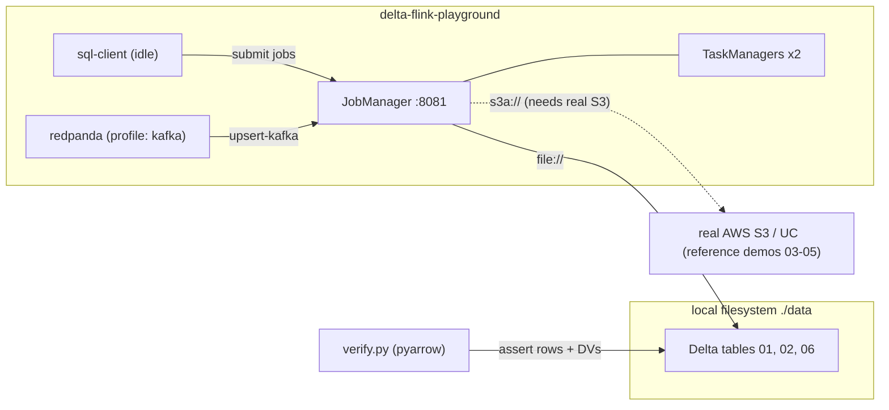

# delta-flink-playground

A batteries-included local playground for the **Delta Lake Flink connector**
(`delta-flink`, the experimental Kernel-based sink shipped in
[Delta 4.4.0](https://github.com/delta-io/delta/issues/7351)). It brings up a
real Flink session cluster in Docker and drives it from the SQL client, with
end-to-end read-back verification, so you can exercise the new 4.4.0 connector
features hands-on.

> The `delta-flink` connector is a **sink-only**, **experimental** build for the
> **Apache Flink 2.0** line. It is not published to Maven, so this playground
> builds the connector fat jar from a local `delta-io/delta` clone.

## What it demonstrates

Each SQL demo maps 1:1 to a Delta 4.4.0 connector change. The two headline
features run fully locally and are verified end to end; the S3/UC demos need real
cloud storage in this experimental build (see [Connector limitations](#connector-limitations)).

**Validated locally (local filesystem):**

- **`sql/01_path_append.sql`** — baseline append to a path-based Delta table (sanity check). ✅
- **`sql/02_upsert_pk_mor.sql`** — **primary-key upserts** ([#6933](https://github.com/delta-io/delta/pull/6933), [#6935](https://github.com/delta-io/delta/pull/6935), [#6977](https://github.com/delta-io/delta/pull/6977), [#6997](https://github.com/delta-io/delta/pull/6997)) + **merge-on-read deletion vectors** ([#6964](https://github.com/delta-io/delta/pull/6964), [#6977](https://github.com/delta-io/delta/pull/6977)). `write.mode=upsert` with a declared `PRIMARY KEY`; a streaming aggregation updates the same keys across checkpoints, so the sink retires old row versions with deletion vectors instead of rewriting files. ✅ (verified: 20 keys + deletion-vector actions)
- **`sql/06_upsert_kafka_cdc.sql`** *(`kafka` profile)* — full **INSERT / UPDATE / DELETE** upsert CDC from Redpanda via `upsert-kafka` (a tombstone = DELETE), to a local-FS table.

**Reference demos (require real AWS S3 / Databricks — see [Connector limitations](#connector-limitations)):**

- **`sql/03_uc_catalog.sql`** — **UC Delta API integration** ([#7229](https://github.com/delta-io/delta/pull/7229), [#7244](https://github.com/delta-io/delta/pull/7244)). `CREATE CATALOG ... 'type'='unitycatalog'` + INSERT into a UC-managed table.
- **`sql/04_ambient_creds.sql`** — **ambient + customer-provided storage credentials** ([#7045](https://github.com/delta-io/delta/pull/7045), [#7048](https://github.com/delta-io/delta/pull/7048)). Path-based S3 write using ambient credentials (via `core-site.xml`).
- **`sql/05_path_handling.sql`** — **path handling fix** ([#7027](https://github.com/delta-io/delta/pull/7027)). Writes to a bucket whose authority contains an underscore; primarily covered by the connector's unit tests.

## Architecture



The local-filesystem demos (01, 02, 06) are fully self-contained and validated.
The S3/UC demos (03–05) are reference-only against local stores in this build —
see [Connector limitations](#connector-limitations).

## Prerequisites

- Docker (with the Compose plugin).
- A local clone of [`delta-io/delta`](https://github.com/delta-io/delta) (to build the connector). Set `DELTA_REPO` in `.env`.
- [`just`](https://github.com/casey/just) and [`uv`](https://github.com/astral-sh/uv).
- For the reference S3/UC demos (03–05): a real AWS S3 bucket (and, for UC, a UC backed by real S3 or Databricks). See [Connector limitations](#connector-limitations).

## Quickstart

```bash
just init            # create .env (then review DELTA_REPO / MAVEN_PROXY_URL)
just jars            # build the connector fat jar (sbt) + download AWS/guava jars
just up-detached     # start the Flink session cluster -> http://localhost:8081

just demo-append     # 01: append + verify (2000 rows)
just demo-upsert     # 02: PK upsert + verify (20 keys + deletion vectors)

just down            # stop the cluster (keeps ./data)
```

`just test` runs the two self-contained local demos end to end and verifies them.

### S3 and UC demos

`just demo-ambient` / `demo-path` / `demo-uc` print how to run sql/03–05. They
require **real AWS S3** (and, for UC, a UC backed by real S3 or Databricks) — the
connector's SQL path can't drive a local S3-compatible store in this build. See
[Connector limitations](#connector-limitations).

### Kafka CDC demo (optional)

```bash
just kafka=on up-detached
just kafka=on demo-upsert-kafka   # produce changelog + tombstone, run job, verify
```

## Building the connector (proxy / firewall)

`just assembly` runs `build/sbt -DflinkVersion=$FLINK_BUILD_VERSION flink/assembly`
in your `$DELTA_REPO` and copies the resulting `delta-flink-*.jar` into
`flink/usrlib/`. Java builds inherit **`$MAVEN_PROXY_URL`** from your shell —
Delta's `build/sbt` sets `-Dsbt.override.build.repos=true`, so every Coursier/Ivy
fetch (and the `sbt-launch` bootstrap) routes through the proxy. If the variable
is not exported, the `.env` value is used, else Maven Central.

The AWS SDK bundle is deliberately excluded from the assembly and supplied at
runtime; `just bundle-jars` downloads it (and guava) from `${MAVEN_PROXY_URL:-Maven Central}`.

### Flink version

- `FLINK_VERSION=2.0.1` — the Flink Docker **image** tag (matches the connector's own docker setup).
- `FLINK_BUILD_VERSION=2.0.2` — the sbt `-DflinkVersion` (the supported 2.0-line build spec). Valid specs: `2.0.2`, `2.1.3`, `2.2.1`, `2.3.0`.

## Layout

- `docker-compose.yaml` — Flink session cluster + idle sql-client (+ Redpanda under the `kafka` profile).
- `flink/usrlib/` — `init.sh` stages jars + renders `core-site.xml` into the Flink dist; the connector/AWS jars land here (git-ignored).
- `sql/` — one SQL script per feature demo.
- `scripts/` — `assembly.sh`, `bundle-jars.sh`, `kafka_produce.sh`.
- `verify/` — `verify.py` (delta-rs read-back + deletion-vector inspection) and `uc_spark.py` (UC table setup/read via Spark).
- `data/` — local Delta tables written by the demos (git-ignored).

## Verifying results

`just verify` reads tables back and asserts row counts, distinct keys, and — for
upserts — the presence of merge-on-read **deletion-vector** actions in
`_delta_log`. (It parses the `_delta_log` and reads the add-file parquet directly
with pyarrow, because the connector declares the `v2Checkpoint` reader feature
which the delta-rs reader rejects.) Browse jobs and checkpoints in the Flink Web
UI at http://localhost:8081.

## Connector limitations

Things discovered while building this playground against the **experimental**
`delta-flink` 2.0.2 build (`io.delta:delta-flink`, Delta 4.4.0). These shape what
the playground can and can't do locally:

- **SQL client never self-exits after `-f`.** It drops to an interactive prompt
  that blocks even on EOF. `scripts/run_sql.sh` therefore submits in the
  background and drives completion off the job's REST state (matched by
  `pipeline.name`), then stops the client.
- **Incremental commits need a clean JobManager cache.** The connector caches
  table snapshots in the JobManager (`table.cache.enable=true`). If you wipe a
  table's files under a live cluster, the cache points at versions that no longer
  exist (`_delta_log/…N.json does not exist`). `just recycle` / `just reset`
  recreate the containers to clear it; the demo recipes do this automatically.
- **Deletion vectors require multiple commits.** A bounded job that finishes
  before its first checkpoint commits once (no old versions to retire → no DVs).
  `sql/02` runs a ~45s streaming aggregation with a 5s checkpoint interval so the
  same keys are updated across commits, producing deletion vectors.
- **The SQL `delta` factory has a fixed option allow-list** (`table_path`,
  `partitions`, `uid`, `name`, `endpoint`, `token`, `write.mode`,
  `sink.parallelism`, `schema_evolution.mode`, `file_rolling.*`). It rejects
  `credentials.source` and `fs.s3a.*` — those `#7045`/`#7048` options are
  DataStream-API only. See [`DeltaDynamicTableSinkFactory.optionalOptions()`](https://github.com/delta-io/delta/blob/master/flink/src/main/java/io/delta/flink/sink/sql/DeltaDynamicTableSinkFactory.java).
- **Custom-endpoint S3 stores don't work via SQL.** `AbstractKernelTable.createEngine()`
  hardcodes `conf.set("fs.s3a.path.style.access", "false")` before loading
  `core-site.xml`; a programmatic `set()` wins over a resource value (even a
  `<final>` one), and only the DataStream `withConfigurations(fs.*)` path
  (`engineConf`) can override it. So MinIO/RustFS (which need path-style
  addressing) fail with virtual-host DNS (`bucket.host`). RustFS additionally
  NPEs the AWS SDK v2 (`ListObjectsV2Response.isTruncated()` is null). The S3
  path-based demos (`sql/03`–`05`) therefore require **real AWS S3** (virtual-host
  addressing) or the DataStream API. They are provided as reference.
