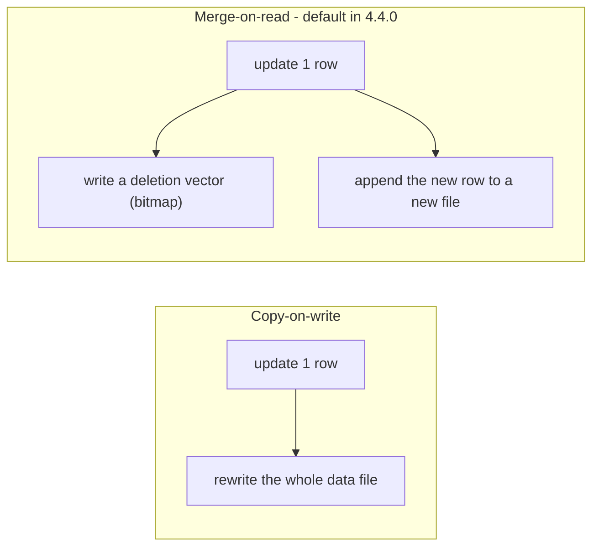

# Streaming upserts into Delta Lake with Apache Flink: what's new in Delta 4.4.0

Delta Lake 4.4.0 is, on the surface, a "platform" release: Apache Spark 4.2
support, identity columns in SQL DDL, generated columns through Unity Catalog,
`SHOW PARTITIONS`, and a batch of Kernel correctness fixes. But tucked into the
release notes is a quieter story that we think is the more interesting one for
streaming practitioners — the experimental **`delta-flink`** connector grew up a
lot.

In this post we'll walk through the five changes that landed in the Flink
connector for 4.4.0, explain *why* each one matters, and get hands-on with a
small local playground so you can watch a Flink SQL job upsert into a Delta table
and retire old row versions with deletion vectors. We'll also be honest about the
rough edges we ran into: the connector is explicitly experimental, and knowing
where the sharp bits are will save you an afternoon.

Everything here targets **Delta 4.4.0** and the **`io.delta:delta-flink`**
connector built for the **Apache Flink 2.0** line.

## Where the Flink connector fits

Before the new features, a bit of grounding. The `delta-flink` connector is:

- **Kernel-based.** It's built on [Delta Kernel](https://docs.delta.io/latest/delta-kernel.html),
  the set of Java libraries that let a connector read and write Delta tables
  without re-implementing the Delta protocol itself. Kernel handles the log,
  checkpoints, protocol/feature negotiation, and the physical read/write; the
  connector focuses on the Flink integration.
- **Sink-only.** There is no source yet — you stream *into* Delta, you don't
  stream *out of* it (for reads, you'd use Spark, `delta-rs`, DuckDB, Trino, and
  so on).
- **Exactly-once.** It integrates with Flink checkpointing and uses a single
  global committer, so each Delta commit is atomic and idempotent across job
  restarts.
- **Built on Flink's Connector V2 (FLIP-27/FLIP-143) APIs**, and usable from both
  the DataStream API and Flink SQL / the Table API.

That last point is where 4.4.0 gets fun: several of the new capabilities are now
reachable straight from SQL.

## The five changes in 4.4.0

### 1. Primary-key upserts from Flink SQL

Historically the sink was append-only. In 4.4.0 you can declare a primary key and
switch the sink into upsert mode
([#6933](https://github.com/delta-io/delta/pull/6933),
[#6935](https://github.com/delta-io/delta/pull/6935),
[#6977](https://github.com/delta-io/delta/pull/6977),
[#6997](https://github.com/delta-io/delta/pull/6997)):

```sql
CREATE TABLE user_totals (
  user_id       BIGINT,
  event_count   BIGINT,
  total_amount  DOUBLE,
  PRIMARY KEY (user_id) NOT ENFORCED
) WITH (
  'connector'  = 'delta',
  'table_path' = 'file:///opt/flink/data/user_totals',
  'write.mode' = 'upsert'
);
```

To understand why this is more than a convenience flag, it helps to remember that
Flink is a *changelog* system. Every row that flows through a streaming query
carries a `RowKind`: `INSERT` (`+I`), `UPDATE_BEFORE` (`-U`), `UPDATE_AFTER`
(`+U`), or `DELETE` (`-D`). A grouped aggregation, a join, or a CDC source all
emit these changes as the result evolves over time.

The upsert sink interprets that changelog against the declared primary key:

- `INSERT` → a new key.
- `UPDATE_AFTER` → replace the existing row for that key.
- `DELETE` → remove the key.
- `UPDATE_BEFORE` → ignored (the `UPDATE_AFTER` carries the full new value).

A primary key is *required* in upsert mode — without one, there's nothing to key
the replace/remove on, and the sink will tell you so at planning time. The nice
consequence is that a keyed changelog (say, an `upsert-kafka` topic, or a
streaming `GROUP BY`) can now materialize its latest state directly into a Delta
table, no separate `MERGE` job required.

### 2. Merge-on-read updates and deletes (deletion vectors)

The obvious way to implement an update or delete on an immutable, file-based
format is *copy-on-write*: read the data file that contains the affected row,
rewrite it without (or with a changed) that row, and swap it into the log. That's
correct, but for streaming upserts it's brutal — a steady trickle of single-row
updates can rewrite large files over and over (classic write amplification).

4.4.0 makes the default upsert strategy **merge-on-read** using **deletion
vectors** ([#6964](https://github.com/delta-io/delta/pull/6964),
[#6977](https://github.com/delta-io/delta/pull/6977)). Instead of rewriting a data
file to retire a row, the connector writes a compact bitmap — a deletion vector —
that marks the deleted row positions in an existing file, and appends the new row
version to a fresh file. Readers reconcile the two at scan time: "read file X,
but skip the positions in its deletion vector."



In the Delta log this shows up as a `remove` of the old file paired with an `add`
that carries a `deletionVector`, plus an `add` for the new rows. On disk you'll
see small `.bin` deletion-vector files (or, for tiny cardinalities, the vector
stored inline). The table property `delta.enableDeletionVectors` gates the
feature. The payoff: streaming updates and deletes stop paying the full-file
rewrite tax.

### 3. Unity Catalog through the UC Delta API

Delta 4.4.0 threads the **UC Delta API** through both Kernel and Flink
([#7229](https://github.com/delta-io/delta/pull/7229),
[#7244](https://github.com/delta-io/delta/pull/7244)). For catalog-managed tables,
the operations that actually touch table state — loading a table, checking
existence, committing, and vending storage credentials — now go through the UC
Delta API, while ordinary catalog browsing continues to use the existing catalog
API.

From Flink SQL, Unity Catalog is a catalog you register and then write into:

```sql
CREATE CATALOG uc WITH (
  'type'     = 'unitycatalog',
  'endpoint' = 'https://<workspace-or-uc-endpoint>',
  'token'    = '<pat-or-oauth>'
);

INSERT INTO uc.my_schema.my_table SELECT id, name FROM src;
```

Why this matters: catalog-managed Delta tables are becoming the norm, and having
the *engine* speak the UC Delta API means commits and credential vending follow
the same governed path whether the writer is Spark, Kernel, or Flink. The Flink
catalog is sink-only for now — it can load and write to existing tables, but it
won't create schemas or tables for you (create those via Spark or the catalog
first).

### 4. Ambient and customer-provided storage credentials

Not every deployment wants Unity Catalog to vend storage credentials. Sometimes
the runtime already has an identity — a workload identity on Kubernetes, an EC2
instance profile, application-default credentials, or plain filesystem config.
4.4.0 adds a switch for exactly that
([#7045](https://github.com/delta-io/delta/pull/7045),
[#7048](https://github.com/delta-io/delta/pull/7048)):

- `credentials.source = ambient` tells the sink to fetch *nothing* from Unity
  Catalog and rely on the ambient environment instead.
- Table options that begin with `fs.` are forwarded straight to the Kernel
  engine's Hadoop configuration — so you can pass, for example,
  `fs.s3a.endpoint` and `fs.s3a.path.style.access` per table rather than editing
  a cluster-wide `core-site.xml`.

Conceptually:

```
credentials.source = uc        # (default) UC vends and rotates temporary creds
credentials.source = ambient   # trust the runtime: workload identity, instance
                               # profile, ADC, or fs.* / core-site.xml settings
```

This is the difference between "the catalog hands me a short-lived token" and
"the box I'm running on already has permission." Both are legitimate; 4.4.0 lets
you choose.

### 5. A path-handling fix worth knowing about

Finally, a small but real correctness fix
([#7027](https://github.com/delta-io/delta/pull/7027)): storage authorities that
contain underscores or user-info components are now preserved during URI
normalization instead of being silently dropped. If you've ever had a bucket or
host name with an underscore quietly break, this is the fix. It's the kind of
change that never makes a keynote but saves someone a confusing debugging session.

## Getting hands-on

Theory is nice; watching deletion vectors appear is better. We'll stand up a
local Flink cluster in Docker, build the connector, and run a streaming upsert.

### Building the connector

The `delta-flink` connector isn't published to Maven yet, so we build the
assembly (fat) jar from a local clone of
[`delta-io/delta`](https://github.com/delta-io/delta):

```bash
# from your delta-io/delta clone
build/sbt -DflinkVersion=2.0.2 flink/assembly
# -> flink/target/delta-flink-2.0.2-<version>.jar
```

`-DflinkVersion` selects which Flink line to compile against; the connector is
tested across the 2.0–2.3 lines, and 4.4.0 ships built for Flink 2.0. If you're
behind a corporate mirror, Delta's `build/sbt` honors `MAVEN_PROXY_URL` and routes
every dependency fetch through it — no `build.sbt` edits required.

The assembly bundles Delta Kernel but deliberately *excludes* the AWS SDK bundle
so the jar stays slim; you supply that (and Guava) on the Flink classpath at
runtime if you need S3.

### Standing up a cluster

A stock `flink:2.0.1` image plus an init script that copies the connector jar
into `/opt/flink/lib` is all it takes. A JobManager, a couple of TaskManagers, and
an idle container to run the SQL client against is a complete playground. (The
companion `delta-flink-playground` repo wires this up with a `Justfile`, but the
moving parts are just Docker Compose and `sql-client.sh`.)

### An append, to warm up

```sql
CREATE TEMPORARY TABLE src (
  id BIGINT, category STRING, price DOUBLE
) WITH (
  'connector' = 'datagen',
  'number-of-rows' = '2000',
  'fields.id.kind' = 'sequence', 'fields.id.start' = '1', 'fields.id.end' = '2000'
);

CREATE TEMPORARY TABLE delta_sink (
  id BIGINT, category STRING, price DOUBLE
) WITH (
  'connector'  = 'delta',
  'table_path' = 'file:///opt/flink/data/01_path_append',
  'uid'        = 'dfp-01'
);

INSERT INTO delta_sink SELECT id, category, price FROM src;
```

Point any Delta reader at `./data/01_path_append` afterward and you'll find 2,000
rows and a two-commit `_delta_log` (one for table creation, one for the append).

### The upsert, where it gets interesting

Now the payoff. We drive a streaming aggregation over a *small* key domain so the
same keys are updated repeatedly, and we let the job checkpoint several times:

```sql
SET 'execution.checkpointing.interval' = '5s';

CREATE TEMPORARY TABLE events (
  user_id BIGINT, amount DOUBLE
) WITH (
  'connector' = 'datagen',
  'number-of-rows' = '4500', 'rows-per-second' = '100',
  'fields.user_id.min' = '1', 'fields.user_id.max' = '20'
);

CREATE TEMPORARY TABLE user_totals (
  user_id BIGINT, event_count BIGINT, total_amount DOUBLE,
  PRIMARY KEY (user_id) NOT ENFORCED
) WITH (
  'connector' = 'delta',
  'table_path' = 'file:///opt/flink/data/02_upsert_pk_mor',
  'write.mode' = 'upsert',
  'uid' = 'dfp-02'
);

INSERT INTO user_totals
SELECT user_id, COUNT(*) AS event_count, SUM(amount) AS total_amount
FROM events GROUP BY user_id;
```

The aggregation emits `+I` for each `user_id` the first time it sees it, then a
stream of `+U`s as the counts climb. Each checkpoint is a Delta commit. The first
commit for a key is an insert; every subsequent commit that updates a key already
in the table is where merge-on-read kicks in — the connector writes a deletion
vector to retire the previous version and appends the new one.

When the job finishes, the table holds exactly 20 rows (one per key), but the log
tells the real story:

```text
_delta_log/00000000000000000000.json   # create
_delta_log/00000000000000000001.json   # first commit: adds
_delta_log/00000000000000000002.json   # remove + add(deletionVector) + add
...
deletion-vector .bin files alongside the data files
```

Grep the commit JSON for `deletionVector`, or count the `.bin` files, and you can
see the merge-on-read behavior directly. That's the whole point: the final state
is small and correct, and we never rewrote a full data file to get there.

## Notes from the field

The connector is experimental, and we hit a few things worth passing along. None
of these are dealbreakers — they're the difference between "why isn't this
working" and "ah, that's expected."

- **Deletion vectors need more than one commit.** A bounded job that finishes
  before its first checkpoint commits exactly once, with the fully-reduced
  result — so there are no prior versions to retire and you'll see no deletion
  vectors. If you want to *watch* merge-on-read happen, make sure the job
  checkpoints multiple times while the same keys keep changing (a longer stream
  and a short checkpoint interval, as above), or drive real updates/deletes
  through a keyed source like `upsert-kafka`.

- **Snapshot caching lives in the JobManager.** The connector caches table
  snapshots per path (`table.cache.enable=true`) for performance. That's great in
  production, but during local iteration it means you can't delete a table's files
  out from under a running cluster and reuse the same path — the cache will still
  believe the table is at a version that no longer exists on disk. Recreate the
  cluster (or use fresh paths) when you wipe tables.

- **Flink SQL vs. the DataStream API.** In this build, the SQL `delta` factory
  accepts a fixed set of options (`table_path`, `partitions`, `uid`, `write.mode`,
  `file_rolling.*`, the UC `endpoint`/`token`, and a few more). The
  `credentials.source` and `fs.*` options from feature #4 are honored on the
  **DataStream API** path, not in a SQL `WITH` clause — from SQL you supply those
  filesystem settings via `core-site.xml` instead. It's worth checking
  `optionalOptions()` in the factory for the exact list before assuming an option
  is settable in SQL.

- **Custom S3 endpoints want path-style access.** S3-compatible stores like MinIO
  need path-style addressing (`endpoint/bucket`) rather than virtual-host
  (`bucket.endpoint`). The engine's default leans toward virtual-host, so for a
  custom endpoint you'll want to force path-style through the config path that
  actually reaches the engine (the DataStream `fs.*` options). Real AWS S3, which
  uses virtual-host addressing, works out of the box.

- **Reading these tables back.** Because the sink opts into the `v2Checkpoint`
  table feature, some readers that don't yet support that reader feature will
  refuse the table. Spark, DuckDB's Delta extension, and reading the add-file
  Parquet directly (after parsing `_delta_log`) all work; if your favorite reader
  complains about an unsupported reader feature, that's why.

## Wrapping up

The headline of Delta 4.4.0 might be Spark 4.2 and identity columns, but for
anyone doing streaming ingestion the Flink story is the one to watch. Primary-key
upserts plus merge-on-read deletion vectors turn the sink from "append-only file
writer" into something that can maintain keyed, mutable state cheaply — and the
UC Delta API and ambient-credential work make it fit into governed and
self-managed deployments alike.

It's still experimental, and it shows in a few places. But the shape of it is
clear and, we think, genuinely exciting: a Flink job that keeps a Delta table
up to date, keyed by primary key, without a separate compaction or `MERGE`
pipeline. That's a capability worth getting familiar with now, so you're ready
when it graduates.

### References

- [Delta Lake 4.4.0 release notes (preview)](https://github.com/delta-io/delta/issues/7351)
- Primary-key upserts: [#6933](https://github.com/delta-io/delta/pull/6933), [#6935](https://github.com/delta-io/delta/pull/6935), [#6977](https://github.com/delta-io/delta/pull/6977), [#6997](https://github.com/delta-io/delta/pull/6997)
- Merge-on-read / deletion vectors: [#6964](https://github.com/delta-io/delta/pull/6964), [#6977](https://github.com/delta-io/delta/pull/6977)
- UC Delta API integration: [#7229](https://github.com/delta-io/delta/pull/7229), [#7244](https://github.com/delta-io/delta/pull/7244)
- Ambient / customer-provided credentials: [#7045](https://github.com/delta-io/delta/pull/7045), [#7048](https://github.com/delta-io/delta/pull/7048)
- Path handling fix: [#7027](https://github.com/delta-io/delta/pull/7027)
